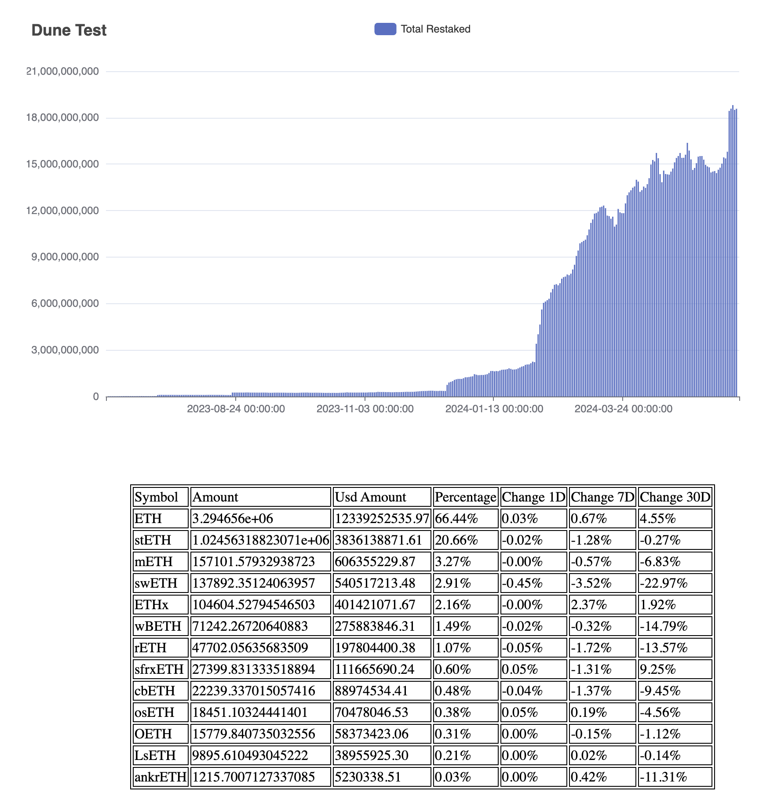

# Dune Test

Creates html file with bar-chart and table

Consumes token for Dune API and result file path as input arguments

For building binary use:

`go build -o=out/dune-test .`

To execute built binary use:

`./out/dune-test <your-api-token> <result-path.html>`

Result PNG:

